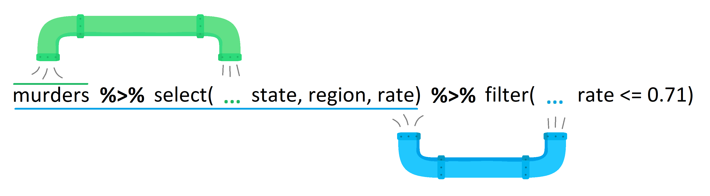

```{r}
#| include: false
knitr::opts_chunk$set(echo = TRUE)
```

# 2-dimensional Data and the `tidyverse`

## Learning Outcomes

-   Students will be able to load packages.
-   Students will be able to use some functions of the tidyverse: select, filter, the pipe, mutate, summarize, and group by.
-   Students will compare and contrast base R and tidyverse methodology for subsetting data frames.
-   Students will be able to use tidyverse functions to summarize real-world data.

## The `tidyverse`: What is it?

Different programming languages have different syntax (language structure). The `tidyverse` is a package (more accurately, a set of packages) offered in R that all have similar goals and a unified syntax designed to work particularly well with 2-dimensional data.

Until now, all of the coding we have done is in the original R language, which is often called "base R." The syntax in the `tidyverse` is often pretty different from base R. Both are useful, and many people often combine them, which is why we start with base R.

That said, we will be primarily using the `tidyverse` for the rest of the course.

### Wait, what is a package??

Packages are one of the neatest things of working in an open-source environment like R! They contain bits of code (often in the form of functions) that can be reused, making them a core component of reproducible data science. Anyone can develop a package, and there are thousands of them doing all sorts of things.

You *install* a package once, but you *load* it with `library()` every time you start a new R session.

### Explore the `tidyverse`

If you want to learn more about the tidyverse, head over to [www.tidyverse.org](www.tidyverse.org) and browse the site. Below is a brief summary of *some* of the packages that are particularly useful for this course.

-   `tidyr`: creating data that is consistent in form/shape
-   `dplyr`: creating data that is clean, easily wrangled, and summarized
-   `ggplot2`: publication-worthy plots using The Grammar of Graphics
-   `tibble`: data frames but better!
-   `readr`: fast and friendly ways to read data into R
-   `stringr`: easy manipulation of strings (character data)
-   `lubridate`: easy manipulation of time and date values

## Practice with the `tidyverse`

### Download and Install

In most scenarios, you will need to download a package from the internet onto your computer before you can use it in RStudio. However, with Posit Cloud, this step has already been done for you!

For future reference, though:

-   you usually only need to go through this process once until you update R
-   we use the function `install.packages()` to download the package

```{r}
#| message: false
# download and install the tidyverse package(s)
# to run the line of code, remove the # in front of the line below and run this chunk
# install.packages("tidyverse")
```

### Load Packages into R

Any time we open R/RStudio and want to use functions from the `tidyverse`, we need to "load" the package. We use the `library()` function to do this.

When you run this code, you'll see a message that says "Attaching packages" and "Conflicts." Don't panic!

-   The first bit tells us that the core packages have been brought into our R session.
-   The "conflict" part is a little more complicated but we don't need to worry too much about it.
    -   If you're curious, though, it is telling us that there are some functions in the `tidyverse` that have the same names as functions that are automatically installed with R and that the `tidyverse` versions of those functions will be the ones that get used by default unless we specify otherwise.

```{r}
#| message: false
# load the tidyverse (tell RStudio we want to use this package in this session)
library(tidyverse)
```

### Climate Data

To learn about the `tidyverse` syntax, we're going to use a real data set on climate change from Berkeley, CA, USA. It outlines temperatures in major cities across the world since 1750.

```{r}
# read in the data file

# `read_csv()` is part of the `tidyverse` and gives us nice options when reading in data
climate_df <- read_csv("data/global_temps.csv")

# Let's take a look at the climate data. 
climate_df
```

The `tidyverse` converts 2D data into something called a tibble! For our intents and purposes, it is basically the same as a data frame (and we'll use the terms interchangeably).

As a quick reminder, *columns* represent variables and are vertical. *Rows* represent observations and are horizontal.


Let's take a look at our tibble (AKA data frame).

```{r}
# explore the data set
head(climate_df)
str(climate_df)
```

## `select()`ing Columns

Let's use our first function, `select()`. Select allows us to pick out specific columns from our data. You can use names or their position in the data frame.

First, let's remind ourselves how we would accomplish this in base R.

```{r}
# column selection in base R
# climate_df$dt
climate_df[,1:2]
```

The `select()` function does the same thing but with more power and more readable syntax. The first argument in the function is the data frame. Any following arguments are the columns we want to select.

```{r}
# first argument is the data frame, then the columns
select(climate_df, dt)

# multiple columns
select(climate_df, dt, City, Country)
select(climate_df, dt:Country)
select(climate_df, -City)
```

Note that we haven't put any column names in quotations. Using the `tidyverse`, we will rarely (if ever, in this class) put column names in quotation marks.

### Let's practice!

Write a line of code to select the following data from the `climate_df`: average temperature, latitude and longitude

```{r}
# Write your code here

```

::: instructor-only
**Answer:**

```{r}
select(climate_df, AverageTemperature, Latitude, Longitude)
```
:::

It is important to remember that the computer interprets everything literally. We need to tell the function the **exact** names of the columns. R will interpret `latitude` and `Latitude` as different things; it doesn't know that they are probably the same!

## `filter()`ing Rows

`filter()` allows you filter rows by certain conditions. The code below is how we would do this in base R.

```{r}
# base R
climate_df[climate_df$AverageTemperature > 25, ]
```

The code above is a bit unwieldy. Filter feels more intuitive. We still need the double equal signs, though!

```{r}
# filter
filter(climate_df, AverageTemperature > 25)

# easy to write multiple conditions and to chain stuff together
# only rows that meet both conditions; could also use & instead of ,
filter(climate_df, AverageTemperature > 25, Country == "United States")   

# rows that meet one or the other condition; the | symbol means `or`
filter(climate_df, AverageTemperature > 25 | Country == "United States" ) 

# pulls rows in which the Country column has either "United States" OR "Mexico"
filter(climate_df, Country == "United States" | Country == "Mexico")      

# worth noting here that we haven't saved any of this. We need to write to a new object. 
us_df <- filter(climate_df, AverageTemperature > 25)
```

## Let's practice using `select()` and `filter()`

Work with the climate data we've been using in this lesson. Construct a small set of code that does the following:

1.  Slims down the full data frame to one that has the date, average temperatures, and the city names. Assign this to an object called `slim`.
2.  Filters the data for Paris with an average temperature less than 22.
3.  Name this new data frame "cold_paris"

```{r}
# Write your code here

```

::: instructor-only
**Answer:**

```{r}
slim <- select(climate_df, dt, AverageTemperature, City)
filtered <- filter(slim, City == "Paris", AverageTemperature < 22)
cold_paris <- filtered
```

**Instructor Note:** Students haven't learned the pipe yet so the unpiped version is correct here.
:::

## The Pipe `%>%`

You can use the pipe operator to chain `tidyverse` functions together.

You can think of the pipe as automatically sending the output from the first line into the next line as the input. The output of the previous line of code (to the "left" of the pipe) becomes the first argument in the function to the right of the pipe.

{fig-align="center" width="75%"}

This is helpful for a lot of reasons, including:

1.  removing the clutter of creating a lot of intermediate objects in your work space, which reduces the chance of errors caused by using the wrong input object
2.  makes things more human-readable (in addition to computer-readable)

The shortcut for typing a pipe is `Ctrl` + `Shift` + `M` (or `Cmd` + `Shift` + `M` on a Mac)

::: instructor-only
**Instructor Note:** Newer versions of RStudio (2022 and later) default this shortcut to the native pipe `|>` instead of `%>%`. Both work for everything in this course, but if students get `|>` when they expected `%>%`, go to **Tools → Global Options → Code** and check "Use native pipe operator" - uncheck it to default back to `%>%`, or reassure students that `|>` is fine to use. It's worth deciding which one you want the class to use and making it consistent.
:::

```{r}
climate_df %>% 
  select(dt, City)

cold_paris <- climate_df %>%
  select(dt, AverageTemperature, City) %>%
  filter(City == "Paris", AverageTemperature < 22)
```

### Let's practice!

In small groups, use pipes to create a new data frame called `warm_nigeria` that includes the following:

-   the columns AverageTemperature, City, Country
-   only rows for the country Nigeria and temperatures that are greater than 30 degrees

```{r}
# Write your code here

```

::: instructor-only
**Answer:**

```{r}
warm_nigeria <- climate_df %>% 
  select(AverageTemperature, City, Country) %>% 
  filter(Country == "Nigeria", AverageTemperature > 30)
```

**Instructor Note:** A common mistake here is putting `filter()` before `select()` and then getting an error because the pipe tries to filter on `Country` after it has already been dropped. If students hit this, it's a great moment to learn about the order of operations in a pipe chain.
:::

## Turning Data into Information with `summarize()`

Some of the best ways to understand data are through what we call summary statistics such as the mean (average), standard deviation, minimums, maximums, etc. Fortunately, the `tidyverse` has a handy-dandy function to make this easy to do with data frames.

The `summarize()` function creates a new data frame with columns and values we give it.

The first part of the argument in the `summarize` function (before the `=`) is the name of the new column we want to create. After the `=` is code that produces the values we want the new column to contain.

| `summarize(new_column_name = summary_function(column_to_summarize))`

```{r}
# first attempt at mean and sd of average temperature
climate_df %>% 
  summarise(mean_temp = mean(AverageTemperature),
            sd_temp = sd(AverageTemperature))
```

Wait a second! Those are some weird values!

`NA` is how R represents missing data. The problem is that even one `NA` in a column causes `mean()` and `sd()` to return `NA` by default. R won't assume you want to ignore the missing values without being told to.

Fortunately, `mean()` and `sd()` and some other functions have an argument to remove the missing values: `na.rm = TRUE`

```{r}
climate_df %>% 
  summarise(mean_temp = mean(AverageTemperature, na.rm = TRUE),
            sd_temp = sd(AverageTemperature, na.rm = TRUE))
```

Pay attention to where the `na.rm = TRUE` argument is placed. We are putting it inside the parentheses for the `mean()` and `sd()` function, not as an argument in the `summarize()` function.

## Split, Apply, Combine with `group_by()`

One common way we analyze data is through something we call the "split, apply, combine" approach. This means that we:

-   *split* data up into groups via some type of categorization
-   *apply* some type of analysis to each group independently and
-   *combine* the data back together

The `group_by()` function lets us do this. It is most often used in combination with `summarize()`.

For example, we can use this method to calculate the mean temperatures of **each** country instead of the overall mean of the entire dataset. In order to do this, we create groups in the data based on the country.

```{r}
climate_df %>% 
  group_by(Country) %>% 
  summarise(mean_temp = mean(AverageTemperature, na.rm = TRUE),
            sd_temp = sd(AverageTemperature, na.rm = TRUE))
```

### Let's practice!

Practice using the combination of `group_by()` and `summarize()` to calculate the minimum (`min()`) and maximum (`max()`) average temperatures for each city. Save this data frame as `city_min_max`.

```{r}
# Write your code here

```

::: instructor-only
**Answer:**

```{r}
city_min_max <- climate_df %>% 
  group_by(City) %>% 
  summarize(min_temp = min(AverageTemperature, na.rm = TRUE),
            max_temp = max(AverageTemperature, na.rm = TRUE))
```

Already accomplished this task? Try to figure out how you can keep the "Country" column in the final data frame. This is trickier than you might think!

```{r}
climate_df %>% 
  group_by(Country, City) %>% 
  summarize(min_temp = min(AverageTemperature, na.rm = TRUE),
            max_temp = max(AverageTemperature, na.rm = TRUE))
```

**Instructor Note:** The bonus challenge works because `group_by()` can take multiple columns. Students often try to add `select(Country)` somewhere in the pipe instead, which either drops columns they need or doesn't work as expected.
:::

## Creating New Columns with `mutate()`

Sometimes our data frame doesn't have our data points in exactly the format we want. For example, we might want our temperature data in Fahrenheit instead of Celsius.

The `tidyverse` has a function called `mutate()` that lets us create a new column. Often, we want to apply a function to the entire column or perform some type of calculation, such as converting temperature from Celsius to Fahrenheit.

Like the `summarize()` function, the first part of the argument in the `mutate` function (before the `=`) is the name of the new column we want to create (or, sometimes, the name of a column we want to overwrite).

| `mutate(new_column_name = code_producing_values_for_the_new_column)`

To help us out, here is the equation for converting: `Fahrenheit = Celsius * (9/5) + 32`

```{r}
# create a new column for temps in Fahrenheit
climate_df %>% 
  select(dt, AverageTemperature) %>% 
  mutate(AverageTemperature_F = AverageTemperature * (9/5) + 32)
```

### Let's Practice

Write some code that uses the `round()` function to create a new column of average temperatures (Celsius) rounded to one decimal place.

```{r}
# Write your code here

```

::: instructor-only
**Answer:**

```{r}
climate_df %>% 
  mutate(AverageTemperatureRound = round(AverageTemperature, digits = 1))
```

**Instructor Note:** Students may try `round(AverageTemperature, 1)` without the `digits =` argument name, that also works.
:::

If we set the "new" column name in the `mutate()` function as the same name of a column that already exists, the code will replace that column with the new values.