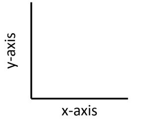

```{r}
#| include: false
knitr::opts_chunk$set(echo = TRUE)
```

# Intro to `ggplot2`

## Learning Outcomes

-   Students will be able to describe the structure of a `ggplot2` plot.
-   Students will be able to build a scatter plot using `ggplot2` by adding layers.
-   Students will be able to label axes and apply a theme to improve plot readability.

So far, we've used the base R plotting syntax. While quick plots in base R can still be really useful ways to do preliminary data exploration and visualization, we often want plots that go beyond the basics without too much additional effort. This is where `ggplot2` comes in and really shines!

## Example

Before we get into the nitty-gritty of how `ggplot2` works, let's run an example using the data about our sick crew members from earlier.

First, we need to load in both the `tidyverse` package and our data. We can remind ourselves what the data look like using the `head()` function.

```{r}
#| message: false
# load package
library(tidyverse)

# load data
sick <- read_csv("data/sick_data.csv")
head(sick)
```

Here is code to make a scatter plot of the relationship between proportion of fish in diets and how many trips to the doctor.

```{r}
ggplot(sick, aes(x = perc_fish, y = doctor_trips)) +
  geom_point() +
  labs(x = "Proportion of Fish in Diet",
       y = "Number of Trips to the Doctor") +
  theme_light()
```

Nice, right? In the next few lessons, we will really start to see the power of `ggplot2`. For now, though, let's focus on how this works.

## `ggplot2`

The package `ggplot2` is part of the `tidyverse`.

Here are some resources you might find helpful now or in the future:

-   [ggplot2 Book](https://ggplot2-book.org/getting-started.html)
-   [UC Business Analytics ggplot2 intro](https://uc-r.github.io/ggplot_intro)
-   [R for Data Science Data Visualization chapter](https://r4ds.had.co.nz/data-visualisation.html)

The `gg` in `ggplot2` stands for "Grammar of Graphics." The "grammar" part is based on an idea that all statistical plots have the same fundamental features: data and mapping (and specific components of mapping).

The design is that you work iteratively, building up layer upon layer until you have your final plot.

Every `ggplot2` plot is built from the same few pieces. You start with the `ggplot()` function, tell it which data to use and how to map your variables to the axes inside `aes()`, then add a layer with `+` to choose the kind of plot:

```{r}
#| eval: false
ggplot(data = your_data, aes(x = x_variable, y = y_variable)) +
  geom_type()
```

Here, `your_data` is the data frame you're plotting, `x_variable` and `y_variable` are the columns you want on each axis, and `geom_type()` is the kind of plot (for example, `geom_point()` for a scatter plot). Every extra piece, like axis labels or a theme, gets added as another layer with `+`.

Let's build up to the plot above one step at a time.

1)  Specify the data

```{r}
#| fig-width: 4.5
#| fig-height: 3
ggplot(data = sick)

# ggplot() always starts by drawing a blank coordinate system.
# Nothing will appear until you add at least one geometric layer (a geom function).
```

Most plots display data relative to two axes: the x-axis (horizontal) and the y-axis (vertical).

{fig-align="center"}

You will definitely want to memorize which axis is which!

2)  Specify the x-axis (horizontal) and the y-axis (vertical) in the `aes()` function.

```{r}
#| fig-width: 4.5
#| fig-height: 3
ggplot(data = sick, mapping = aes(x = perc_fish, y = doctor_trips))
```

3)  Add the type of plot we want using a `geom` function. For a scatter plot, we use `geom_point()`.

```{r}
#| fig-width: 4.5
#| fig-height: 3
ggplot(data = sick, mapping = aes(x = perc_fish, y = doctor_trips)) +
  geom_point()
```

4)  Clean up the axis labels with the `labs()` function so they are more easily interpreted.

```{r}
#| fig-width: 4.5
#| fig-height: 3
ggplot(data = sick, mapping = aes(x = perc_fish, y = doctor_trips)) +
  geom_point() +
  labs(x = "Proportion of Fish in Diet",
       y = "Number of Trips to the Doctor") 
```

5)  Choose a `theme` function to make the plot more aesthetically pleasing.

```{r}
#| fig-width: 4.5
#| fig-height: 3
# theme_bw(), theme_classic(), and theme_light() are good options
ggplot(sick, aes(x = perc_fish, y = doctor_trips)) +
  geom_point() +
  labs(x = "Proportion of Fish in Diet",
       y = "Number of Trips to the Doctor") +
  theme_light()
```

In Summary:

-   we always start with the `ggplot()` function
-   we specify the dataset we want to use
-   we specify the mappings (x- and y-axes and some other bits) with the `aes()` function
-   we use a `+` to add layers
-   we specify the type of plot, or `geom` using one of many possible geom functions
-   we use the `labs()` function to clean up the labels
-   we add a `theme` function to make it more visually readable

## Let's Practice

Using the `sick` data, build a `ggplot2` scatter plot that shows the relationship between the proportion of plants in a crew member's diet (`perc_plant`) and their number of doctor trips (`doctor_trips`). Make sure to label your axes clearly and apply a theme.

```{r}
# Write your code here

```

::: instructor-only
**Answer:**

```{r}
ggplot(sick, aes(x = perc_plant, y = doctor_trips)) +
  geom_point() +
  labs(x = "Proportion of Plants in Diet",
       y = "Number of Trips to the Doctor") +
  theme_light()
```

**Instructor Note:** The plant plot shows the inverse pattern from the fish plot, higher plant consumption pairs with fewer doctor visits. Since `perc_fish` and `perc_plant` sum to 1, this is expected. This is a good moment to point out that both plots tell the same story from opposite angles, and to ask students which variable they think is actually driving the illness.
:::