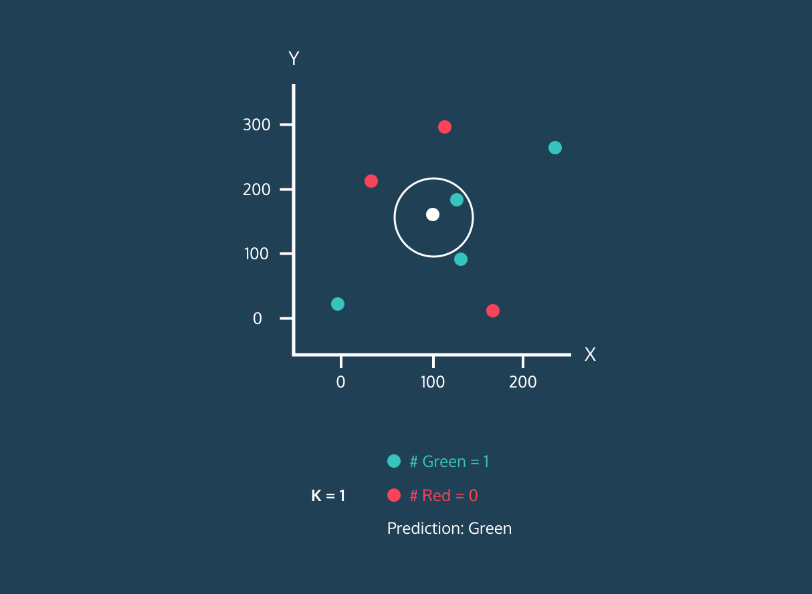

```{r}
#| include: false
knitr::opts_chunk$set(echo = TRUE)
```

# K-Nearest Neighbors

## Learning Outcomes

-   Students will be able to explain the general concept of K-Nearest Neighbors classification.
-   Students will be able to describe the purpose of training and testing data in machine learning.
-   Students will be able to interpret the output of a KNN model including the confusion matrix and predictions.
-   Students will be able to scale data and explain why scaling is necessary for distance-based algorithms.

## Machine Learning

Now, we're going to work through an example of machine learning, which is used in a variety of ways in data science, across industries and disciplines.

Machine learning is a subfield of artificial intelligence (AI). Machine learning uses a data-driven approach; a model is typically trained on data with known outcomes, then the model uses that previous knowledge to predict the outcomes of new data.

Remember, we have 50 unlabeled collars, and we want to be able to predict who made them so we can increase the safety of our fishers. We need to throw out any collars that we think were made by Budget Collars LLC, and only incorporate new collars from our unlabeled batch that we think were made by Collarium Inc.

Given the data we have from the collars we know were created by Budget Collars LLC and Collarium Inc., our goal is to train a model on collars with known makers to then apply to our unknown collars.

## KNN in R

K-nearest neighbors (KNN) is a classification algorithm (e.g., it attempts to predict labels or "classes"). It uses the classes of the nearest neighbors to a new data point (the number of neighbors = k) to predict the class of the new data point.



You don't need to know the inner-workings of the model or even the code below; all you need to know is the overall concept of how K-nearest neighbors works and what the results mean.

### The Basic Idea

At its simplest, KNN labels a new collar by looking at the known collars most similar to it and going with the majority. "Similar" just means close in our measurements. For example, two collars with nearly the same battery life and signal distance are near each other, while two collars with very different values are far apart.

The "k" is how many neighbors we look at. With `k = 5`, we look at the 5 closest known collars; with `k = 9`, the 9 closest. Look back at the diagram above, the white point is the new collar, and with `k = 1` it takes the label of the single closest point.

That's the whole idea you need for this lesson! Here's how we set it up in R:

::: instructor-only
**Instructor Note:**

Some additional information about KNN:

To classify a new, unlabeled point, KNN finds the `k` already-labeled points closest to it (by straight-line distance) and takes a majority vote of their labels. The choice of `k` is a trade-off: a very small `k` can be thrown off by a single unusual neighbor, while a large `k` smooths over local detail and can blur the boundary between groups.

Because everything depends on distance, the features must be on the same scale first, otherwise a variable with big numbers (like signal distance, \~4000) would dominate one with small numbers (like battery life, \~100), no matter how informative each actually is. That's why we scale both before running the model.

If you'd like a video to show or watch yourself, [this one](https://www.youtube.com/watch?v=gs9E7E0qOIc) gives a basic overview of KNN.
:::

### Visualizing

Creating plots that visualize KNN is pretty complicated, so we won't be doing that in this lesson. However, you can find a nice interactive data visualization [here](http://vision.stanford.edu/teaching/cs231n-demos/knn/).

Play around with the data visualization. Can you figure out what it is telling you?

## Classifying Collars

Now that we have an idea of how KNN works, let's get started with our dataset.

Here's our overall trajectory: 1) Load our collars data 2) Split the data into collars where we know the maker and collars where we don't 3) Split the collars with known makers into 2 data frames: one for training our model and one for testing the model out on data where we already know the answers 4) Apply the best model to our collars with unknown makers to get predictions for which maker made the collar

First, we need our data!

### Data Cleaning and Prepping

Load the tidyverse and read in `data/all_collar_data.csv`, saving it as `full_collars`.

```{r}
#| message: false
#| warning: false
library(tidyverse)
full_collars <- read_csv("data/all_collar_data.csv")
```

Next, we need to scale our data.

What does this mean? It means we are transforming the data so that they are all in the same scale. Because KNN uses distances between points to determine neighbors, we need to have our data measured on the same scale.

Before scaling, battery life (\~100) and signal distance (\~4000) were working in very different ranges, with signal distance being much bigger. Once we scale them, they will both have means around 0 and similar standard deviations.

```{r}
# standardize the data and remove unnecessary data

# start with the full data set
knn_data <- full_collars %>%
  # mutate the battery and signal columns to be scaled
  mutate(battery_scaled = scale(battery_life),
         signal_scaled = scale(signal_distance)) %>%
  # remove columns we aren't using anymore
  dplyr::select(-battery_life, -signal_distance, -fail:-weight) %>% 
  # make the maker column a factor (categorical)
  mutate(maker = as.factor(maker))
```

Let's summarize and plot the scaled data to see what it looks like. Let's focus on battery life.

```{r}
knn_data %>% 
  summarise(mean_bat = mean(battery_scaled),
            sd_bat = sd(battery_scaled))

ggplot(knn_data, aes(battery_scaled, fill = maker)) +
  geom_histogram()
```

Take a look at where the two known makers sit: Budget collars (red) lean toward lower battery life and Collarium collars (teal) toward higher, but the two overlap quite a bit through the middle rather than splitting into clean groups.

Keep that overlap in mind, because it will make the model's job harder later on.

Right now, we have 3 collar categories because we haven't separated the unknown collars. Let's do that next.

### Known and Unknown Labels

Before we continue, we need to make separate data frames to work with, one with collars with known makers and one with collars with unknown labels.

```{r}
# we also need to remove the collar_id labels
collars_to_label <- knn_data %>%
  filter(is.na(maker))

# we need to save the collar ids before removing them
unknown_collar_ids <- collars_to_label %>% dplyr::select(collar_id)
collars_to_label <- collars_to_label %>% dplyr::select(-maker, -collar_id)

labeled_collars <- knn_data %>%
  filter(!is.na(maker)) %>% 
  select(-collar_id)

```

### Training and Testing Data

First, we need to train and test our model. We will do that with the data with known collar makers.

Note: this is where the code starts getting a bit complicated. It's ok if you aren't entirely clear on what everything is doing.

```{r}
# randomly choose 30 out of the 100 collars to be our test data
# we will train the model with the other 70 collars, then test how well that model does using the 30 collars we held back
# because we know the actual makers of those 30 collars, we will know if our model made any mistakes

# since randomly choosing, we will use set.seed() to make sure everyone is getting the same values
set.seed(411)

# randomly select 30 row positions (30% of the data) to pull out for testing
rows_to_pull <- sample(1:100, 30)
rows_to_pull

training <- labeled_collars[-rows_to_pull, ] # remove test data from labeled collars
testing <- labeled_collars[rows_to_pull, ] # pull out the 30 rows for testing

```

### Training and Testing KNN

Now that we have training and testing data, we can perform the first phase of KNN.

We want to know how many nearest neighbors we should use and how well our model works on the testing data. We will use the `caret` package to run these analyses.

```{r}
#| message: false
#| warning: false
#loading package to do knn
library(caret)

# set seed again
# training the model and finding the best k value
set.seed(411)
knn_training_model <- train(maker ~ ., data = training, method = "knn")
knn_training_model
```

The output above shows that `caret` tested several values of `k` and kept the one with the highest accuracy, here, `k = 9`. Now we can use this trained model on our 30 testing collars to see how well it does. Because we know who really made those collars, we can count exactly how many the model gets right. We use the `predict` function from `caret` to do this.

```{r}
# making predictions with the test data
knn_predict_test <- predict(knn_training_model, testing)
confusionMatrix(knn_predict_test, testing$maker)
```

Look at the accuracy and the confusion matrix above. Our model got most of the testing collars right, about 83% (25 out of 30), but it did make a few mistakes: in this run it labeled four Collarium collars as Budget and one Budget collar as Collarium.

That isn't a failure, it's what we should expect. Back in Module 3 we saw that Budget and Collarium collars overlap quite a bit in both battery life and signal distance, so some individual collars are genuinely hard to tell apart from those two measurements alone.

Let's apply it to our collars of unknown origin.

### Predicting the Unknown Collar Makers

We will apply the same model but now to the new data.

```{r}
# making predictions for the collars without makers
knn_predict <- predict(knn_training_model, collars_to_label)
knn_predict
table(knn_predict)
```

We have predictions! Our last step is to recombine our data so that the collars now have their new labels.

```{r}
# let's bind the columns together
new_labels <- bind_cols(unknown_collar_ids, predicted_maker = knn_predict)
new_labels
```

Typically, you would want to replace the columns in the entire data frame, but we will end here for today :)

We now have a predicted maker for each unknown collar. Keeping in mind that the model isn't perfect, we would deploy the ones it labeled as Collarium Inc.

::: instructor-only
**Instructor Note:** The model is about 83% accurate, and we're using it to decide which collars to deploy.

Is 83% good enough for a decision like this? What would make us more confident, more training data, more measurements per collar, or a different model?

There's no single right answer. The goal is for students to think about models and their accuracy.
:::