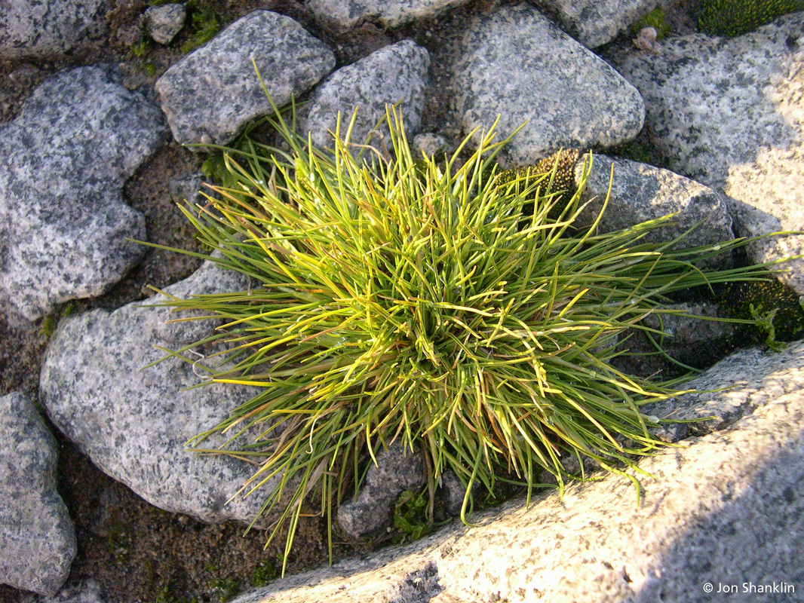
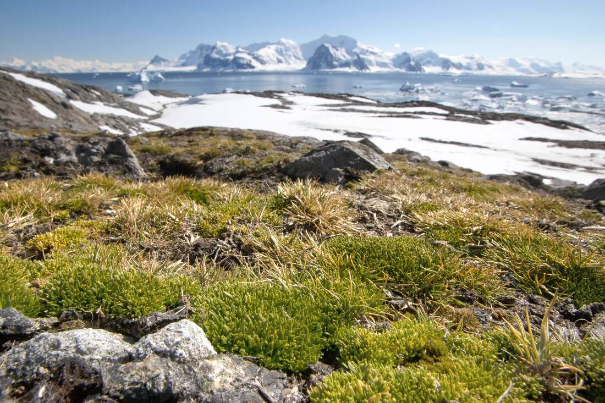
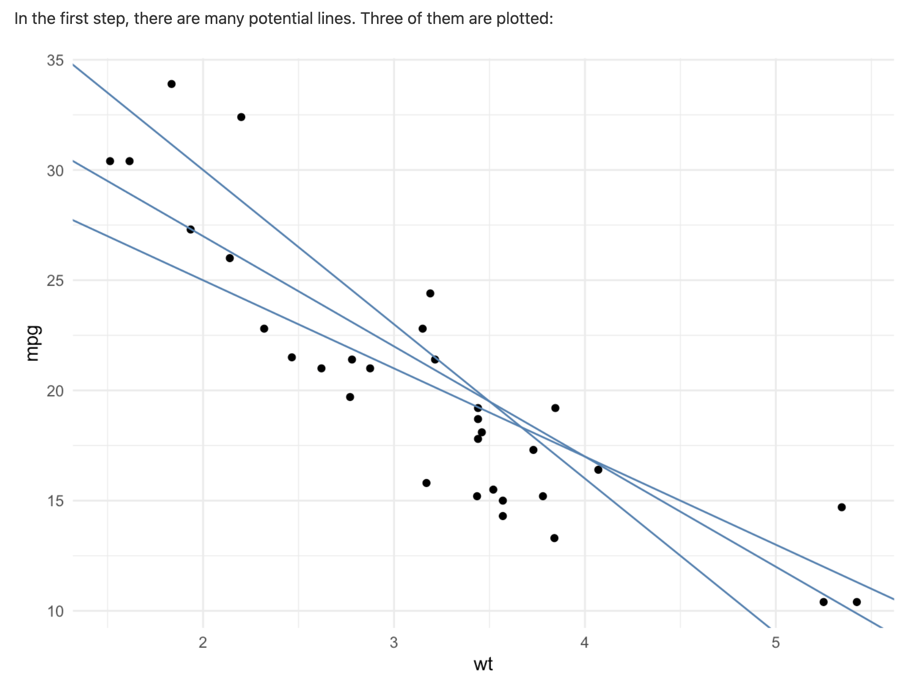
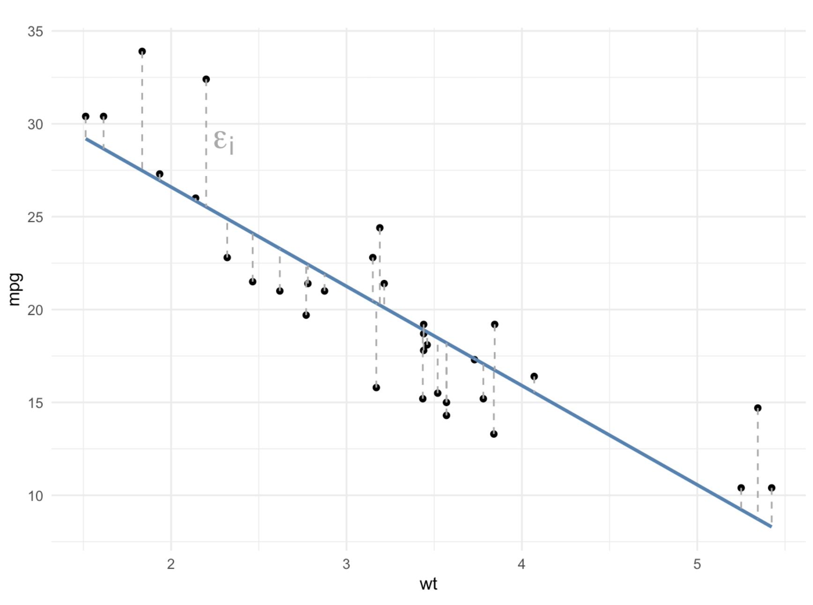
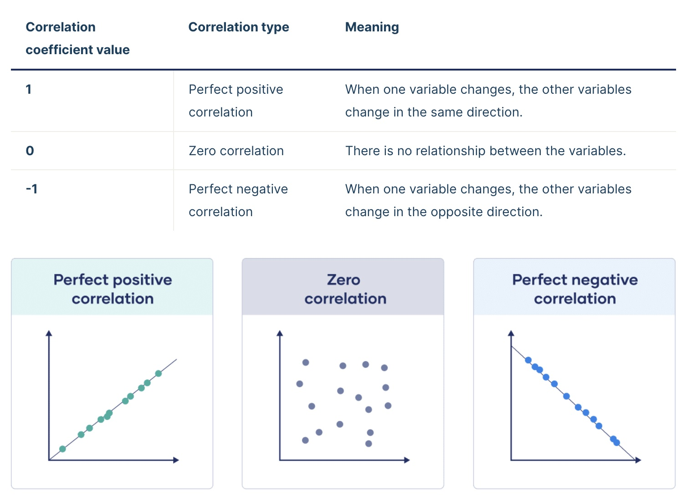
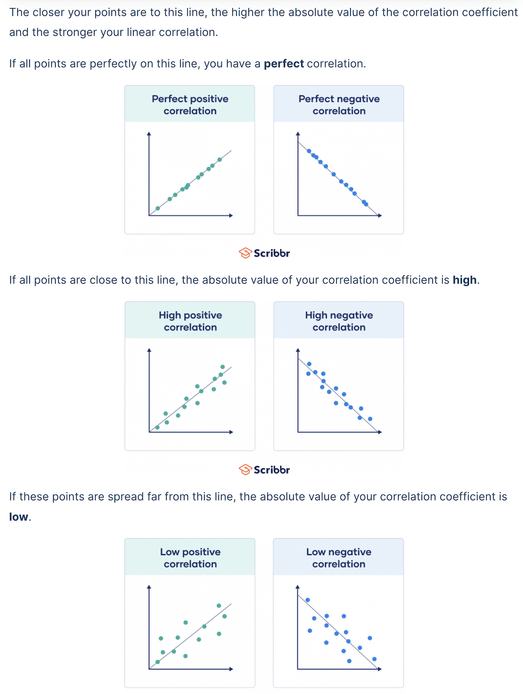
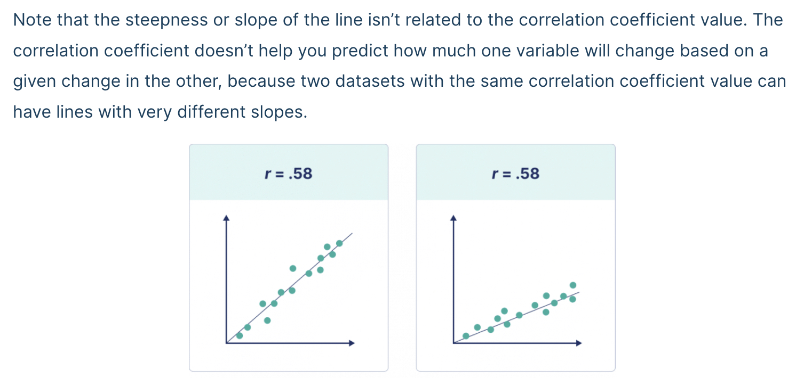

```{r}
#| include: false
knitr::opts_chunk$set(echo = TRUE)
```

# Roads and Regressions

## Learning Outcomes

-   Students will be able to create a scatter plot with a line of best fit using `geom_smooth()`.
-   Students will be able to calculate and interpret a correlation coefficient and R-squared value.
-   Students will be able to run a linear regression using `lm()` and interpret the output including slope, intercept, and p-value.
-   Students will be able to use regression results to inform a data-driven decision.

## The Scenario

In this module, we have tried to figure out which bays we should prioritize for fishing based on the following data sets:

-   radio collar data
-   fish catch data
-   leopard seal abundance data

Based on our results from Assignment 2, we made a decision about which two bays look like our best options. Now, we need to make these bays accessible over land to transport the fish we've caught to our home base.

**Our Goal: build a road while minimizing our impact on the delicate antarctic ecosystem.**

Our first order of business is to make sure that we avoid areas with that are well-suited for [Antarctica hair grass](https://oceanwide-expeditions.com/blog/the-plants-of-antarctic) (*Deschamsia antarctica*), one of only two flowering species of plants on the continent.

{width="50%"}

We want to know what environmental conditions are associated with hair grass. This way, we can avoid areas where these conditions are met and not destroy precious habitat for the hair grass.

It would take far too long to survey every bit of land between our base and our fishing spots, so we are going to build a **model** based on some samples of where hair grass is found to help us predict where else it might be.

### What is a model?

A model is a way for us to take complex systems and break them down into small, more understandable bits. We can use models to help us understand the relationship between different variables. We can then use those models to make predictions based on those relationships.

## Data

{width="50%"}

Knowing that we would soon be building roads, we asked our botanists to collect data for us on key components of the hairgrass' environment. Since it would take too long to sample everywhere hairgrass grows, they collected data from a sample of the hairgrass population.

Our botanists collected data for the following variables:

-   *hairgrass density*: number of individual clumps (tussocks) of hairgrass (per 25 meters squared)
-   *soil pH*: most plants prefer mildly acidic to neutral environments
-   *nitrogen (N) content*: as parts per million (ppm); important for plant growth and tissue building
-   *phosphorous (P) content*: as parts per million (ppm); important for plant growth and tissue building
-   *percent rock*: how rocky the location is; rocks in soil impact water drainage and temperature
-   *max windspeed (knots per hour)*: extreme wind can pose a challenge to plants of all types
-   *average summer temperature (C)*: temperature in the growing season
-   *penguin density*: the number of penguins per the sample quadrant penguin poop increases nitrogen and phosphorus content in the system but penguins may trample the plants

This data is based on this article: [Parnikoza, et al. 2007](https://doi.org/10.1016/j.polar.2007.10.002)

## Summarize and Visualize

As we see above, there are many environmental conditions that may be associated with hair grass density.

For this lesson, we are going to focus on two: *nitrogen (N) content* and *soil pH*.

### Set-Up

As usual, we start with loading tidyverse and our data. Read in "data/hairgrass_data.csv" and save it as an object called `hairgrass_data`.

```{r}
#| message: false
#| warning: false
# Write your code here

```

::: instructor-only
**Answer:**

```{r}
library(tidyverse)
hairgrass_data <- read_csv("data/hairgrass_data.csv")
```
:::

Let's take a look at the data in the data set. What does each row represent?

```{r}
head(hairgrass_data)
tail(hairgrass_data)
```

### Nitrogen Content

Let's start by investigating any relationship between hair grass density and nitrogen content.

First, we should spend a little time thinking about our variables. Spend a few minutes in small groups discussing the answer to the questions below.

-   Which columns are we interested in right now?
-   Which one is the independent variable and which is the dependent variable?
-   Are the variables categorical or continuous?
-   Which type of data visualization should we use?

::: instructor-only
**Answers:** - soil_nitrogen and hairgrass_density - independent = soil_nitrogen, dependent = hairgrass_density - both continuous - scatter plot
:::

Next, calculate the mean (`mean()`) and standard deviation (`sd()`) for the nitrogen content.

```{r}
hairgrass_data %>% 
  summarise(mean_N = mean(soil_nitrogen),
            sd_N = sd(soil_nitrogen))
```

Now that we have summarized the data, let's take a look at the data visually.

```{r}
ggplot(hairgrass_data, aes(soil_nitrogen, hairgrass_density)) +
  geom_point() +
  labs(x = "N Content",
       y = "Hairgrass Density (per 25 m^2)") +
  theme_bw()
```

Do you see a pattern? What type of relationship do you see?

How do we analyze this type of relationship statistically?

## Statistical Analysis

We are going to use two (related) statistical methods to understand the relationship between two continuous (numeric) variables:

-   correlation coefficient ($r$) and R-squared ($R^2$)
-   linear regression

### Line of Best Fit

To understand correlation, R-squared, and linear regression, we first need to talk about something we call the *line of best fit*.

The line of best fit aims to minimize the distance between each observation (points) and the line. The distances between each observation and any line are called *residuals* (the dotted gray lines). The line of best fit is the line that has the smallest *residuals*.

{width="50%"} {width="50%"}

We can add a line of best fit to a ggplot by using the `geom_smooth()` function. We need to specify that the method we want should produce a straight line ("linear model").

```{r}
ggplot(hairgrass_data, aes(soil_nitrogen, hairgrass_density)) +
  geom_point() +
  geom_smooth(method = "lm", se = FALSE) +
  labs(x = "N Content",
       y = "Hairgrass Density (per 25 m^2)") +
  theme_bw()

# method = "lm" is required!
# se = FALSE is optional
```

### Correlation Coefficient

The correlation coefficient, `r`, is a measurement of the strength of the relationship between two continuous variables.

The correlation coefficient is a number between -1 and 1 that looks at the relationship between two numeric variables. If the value is negative, there is a negative relationship between the two variable; if the value is positive, there is a positive relationship.

If all the points fall exactly on the line of best fit, r = 1 or -1. If there is no relationship between the variables, `r` is 0 (or something very close to it).

{width="50%"}

The greater the magnitude (size) of the correlation coefficient, the stronger the relationship between the two variables.

{width="50%"}

It is also important to recognize that the correlation coefficient has nothing to do with the slope of the line (we use linear regression to assess that!)

{width="50%"}

Based on the hairgrass plot we did above, do you expect the correlation coefficient to be positive or negative? For this class, we'll say that any `r` value within 0.1 of 0 means there is no relationship.

To calculate the correlation coefficient, we need to go back to base R and indicate which columns we are referencing with the `$` operator. We use the `cor()` function.

```{r}
r_nitrogen <- cor(x = hairgrass_data$soil_nitrogen, y = hairgrass_data$hairgrass_density)
r_nitrogen
```

### R-squared ($R^2$)

The R-squared ($R^2$) value is a representation of how much variation is explained by the line of best fit.

When we have a dependent variable and an independent variable, the R-squared value tells us how much of the variation in the *dependent* variable is explained by the *independent* variable.

Sometimes we don't have obvious dependent and independent variables, but we can still use similar language ($R^2$ tells us how much of the variation in the data is explained).

To calculate R-squared, we square the correlation coefficient value we calculated above. It is always positive because we are squaring it `r` value; that means that R-squared values range from 0 to 1. The closer to 1, the more variation is explained.

```{r}
r_nitrogen^2
```

How would we interpret this `r^2` value?

::: instructor-only
**Instructor Note:** r = 0.595. a moderate positive relationship. r\^2 = 0.354, meaning nitrogen content explains about 35% of the variation in hairgrass density. This is a meaningful relationship for ecological data.
:::

One way to think of the `r^2` value that might be helpful is to convert it from a proportion to a percentage—what *percentage* of the variation in the dependent variable is explained by the independent variable?

To convert the proportion to a percentage, we can multiply the value by 100.

```{r}
r_nitrogen^2 * 100
```

### Linear Regression Analysis

A regression analysis approximates the relationship between a dependent variable and one or more independent variables. It evaluates the strength of that relationship, ultimately giving us a p-value.

Since we are using linear regressions in this course, the regression model will take the form of a straight line. The generic equation for a straight line is `y = mx + b`.

-   `y` = dependent variable (y-axis)
-   `x` = independent variable (x-axis)
-   `m` = slope of the line
-   `b` = y-intercept

When we have a line with the specific slope and y-intercept, this equation lets us calculate the expected y-axis value for any given point on the x-axis.

Using our variables, what would our linear regression model look like (we don't know `m` or `b` yet...)?

### Hypothesis Testing

What is the null hypothesis? What is the alternative hypothesis?

**Null Hypothesis** ($H_{0}$): There is no relationship between hair grass density and nitrogen content.

**Alternative Hypothesis** ($H_{A}$): There is a relationship between hair grass density and nitrogen content.

What do you think this means for the slopes?

::: instructor-only
**Instructor Note:** The null hypothesis of no relationship corresponds to a slope of 0. If there's no relationship, the line of best fit would be flat. The alternative hypothesis implies a non-zero slope (either positive or negative).
:::

### Regression Analysis

Thankfully, R can calculate the slope (`m`) and y-intercept (`b`) of the line of best fit for us.

Let's find the equation for our line of best fit, our test statistic, and our p-value. To do this, we use a function called `lm()`: this stands for "linear model."

Like with ANOVA, we will then want to use the `summary()` function to get out the values we need.

```{r}
nitrogen_model <- lm(hairgrass_density ~ soil_nitrogen, data = hairgrass_data)
summary(nitrogen_model)
```

As with our other statistical tests---t-tests and ANOVAs---the results give us some important values:

-   `b` (y-intercept): part of our line of best fit equation
    -   The "intercept estimate", in this case 84.24, is our y-intercept in our line of best fit
-   `m` (slope): also part of our line of best fit equation
    -   this is the estimate for our independent variable (soil_nitrogen in this case)
    -   in this model, m = 1.8
-   *F-statistic*: this is our test statistic
-   *p-value*: calculated from our regression model, used to determine significance (0.05 cut-off, as usual)
    -   There are multiple p-values here. Focus either on the p-value for the independent variable (soil_nitrogen) or the overall p-value displayed in the last line of the results summary (p \< 2.2e-16)
-   *R-squared*: this is our R-squared value that we calculated earlier
    -   You can report either the "multiple" or the "adjusted"
    -   The "multiple" will typically match the one we calculate with code

This means our equation for the line of best fit is: y = 1.8x + 84.24 and there is a statistically significant relationship between nitrogen content and hairgrass density.

## Soil pH

Let's do the same series of steps to determine how soil pH impacts hair grass densities.

Work on this in your small groups.

::: instructor-only
**Instructor Note:** Work in small groups for about 10 minutes, then review as a class.
:::

Start with summarizing the data: mean and standard deviation.

```{r}
# Write your code here

```

Visualize the data. Remember to add in the line of best fit using `ggplot2`. Also add labels and a theme.

```{r}
# Write your code here

```

Calculate the correlation coefficient (`r`). What does this tell us?

```{r}
# Write your code here

```

How much variation does soil pH explain in the hair grass density data?

```{r}
# Write your code here

```

Write out the model equation for our question about soil pH (without values).

Run the regression model and write out the equation for the line of best fit.

```{r}
# Write your code here

```

Interpret the results of the regression. What do we conclude about the relationship between soil pH and hair grass density, and why?

::: instructor-only
**Answers:**

```{r}
hairgrass_data %>% 
  summarize(mean_pH = mean(soil_ph),
            sd_pH = sd(soil_ph))
```

```{r}
ggplot(hairgrass_data, aes(soil_ph, hairgrass_density)) +
  geom_point() +
  geom_smooth(method = "lm", se = FALSE) +
  labs(x = "Soil pH",
       y = "Hairgrass Density (per 25 m^2)") + 
  theme_bw()
```

```{r}
r_ph <- cor(x = hairgrass_data$soil_ph, y = hairgrass_data$hairgrass_density)
r_ph
```

r = -0.131. a weak negative relationship, barely outside the "no relationship" threshold of 0.1.

```{r}
r_ph^2
```

`r^2` = 0.017. soil pH explains only about 1.7% of the variation in hairgrass density.

Model form: hairgrass_density = m(soil_ph) + b

```{r}
ph_model <- lm(hairgrass_density ~ soil_ph, data = hairgrass_data)
summary(ph_model)
```

Equation for line of best fit: y = -4.648x + 150.24

p = 0.0421, which is less than 0.05, so we reject the null hypothesis. There is a statistically significant relationship between soil pH and hairgrass density.

However, look at `r^2` = 0.017. That means soil pH explains only 1.7% of the variation in hairgrass density. The relationship is real but extremely weak.

**A p-value tells us whether a relationship exists, r\^2 tells us how strong it is. Here, the relationship technically exists but is far too weak to be a meaningful predictor. Nitrogen (r\^2 = 0.354, explaining 35% of variation) is a way better predictor of where hairgrass thrives.**
:::

## Data-driven Decision Making

The reason we are using regression analysis is to inform where we should (or should not) build our road so we don't harm the sensitive hair grass or take away their prime habitat.

What do results above for nitrogen content and soil pH mean for the road we are building?

::: instructor-only
**Instructor Note:** Nitrogen content is by far the stronger predictor. r\^2 = 0.354, meaning it explains 35% of the variation in hairgrass density (p \< 2.2e-16). Higher nitrogen strongly predicts higher hairgrass density. **Road planning should prioritize avoiding high-nitrogen areas.**

Soil pH is statistically significant (p = 0.0421) but practically very weak. r\^2 = 0.017 means it explains only 1.7% of the variation. While the negative slope suggests more acidic soils have slightly higher density, this relationship is too weak to be a reliable guide on its own.

**p \< 0.05 tells us a relationship exists, but r\^2 tells us whether it is actually strong enough to be useful.** Soil pH passes the significance threshold but fails the usefulness test.
:::