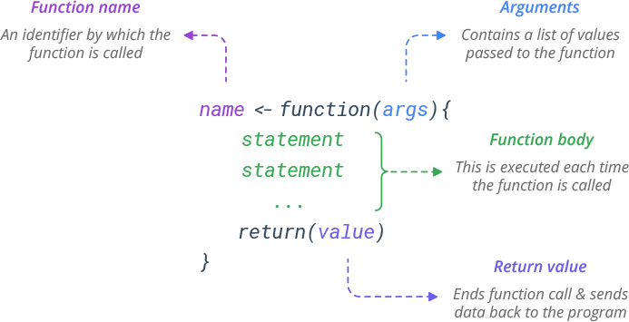

```{r}
#| include: false
knitr::opts_chunk$set(echo = TRUE)
```

# Functions

## Learning Outcomes

-   Students will be able to explain what a function is and identify its arguments, body, and return value.
-   Students will be able to write a custom function that performs a simple task.
-   Students will be able to explain why functions are useful and how they connect to repeating a task.

## Introduction

In this lesson, we'll learn how to write functions in R. Functions let you automate tasks and reuse code across your entire dataset.

Let's get started!

### What is a function?

We've actually been using functions quite a lot in the course already, but let's remind ourselves *exactly* what a function actually is.

A function is a block of code designed to perform a specific task. A function is **executed** when it is **called.** This means that the block of code is run every time you use the function!

A function takes specific **arguments** as input, processes them, and **returns** the output.

{width="515"}

We've used a lot of built-in functions already, for example, the `mean()` function.

Now, we are going to write our own functions!

### Writing Our First Function

Following the syntax from the image above, let's write a function called `add_numbers` that takes **two numbers as arguments and returns their sum.**

```{r}
add_numbers <- function(x, y) {
  z <- x + y
  return(z)
}
```

Notice that we didn't put any actual numbers in the function! Instead, we used generic arguments (e.g., `x` and `y`) to represent the values that will fill those slots when we call the function.

Inside the function body, we write a statement that adds `x` and `y` together and saves that value as an object called `z`.

We use the `return()` function to indicate that `z` is the value we want the `add_numbers` function to give back to us when it is executed.

Let's test our function with numbers, now!

```{r}
add_numbers(5, 5)

my_sum <- add_numbers(10, 10)

my_sum
```

#### Let's Practice

Now try to write a function called `multiply_numbers` that takes **three** numbers as arguments and returns the **product.**

Make sure to test your function, and remember a function should have a name, a list of arguments, and return something. Use the same syntax as our `add_numbers()` example above.

```{r}
# Write your code here

```

::: instructor-only
**Answer:**

```{r}
multiply_numbers <- function(x, y, z) {
  product <- x * y * z
  return(product)
}

multiply_numbers(1, 3, 3)
```
:::

### Why write our own functions?

We just wrote `add_numbers`, but R can already add with `+`. So why bother writing functions at all?

Once a task is wrapped in a function, you can run it on new inputs again and again without rewriting the code, and you can apply it across an entire column of data in one line. 

Think back to how `mutate()` applied a calculation to every row of a data frame: a function lets you package up any task you want and hand it to tools like `mutate()` to repeat across all your data.

## Functions That Work on Data

For the rest of the lesson, we'll write functions that operate on a data frame. Let's load the tidyverse and our hairgrass data first.

```{r}
#| message: false
#| warning: false
# Write your code here

```

::: instructor-only
**Answer:**

```{r}
library(tidyverse)
hairgrass <- read_csv("data/hairgrass_data.csv")
```
:::

### Exercise 1: Simple Function

**Objective:** Write a function called `inspect` that takes a data frame as an argument and prints the head and tail of the data frame.

Before we attempt to write this function, you'll need to know about the `print()` function.

In R, when a function has multiple output statements, it only displays the last one by default. To see all outputs, wrap each one in the `print()` function.

```{r}
# demonstration of the print function
print(mean(hairgrass$soil_ph))
```

Now we can start to write our function! Fill in the blanks below so the function prints the head and tail of the data frame. If you're up for an extra challenge, have it print the first 10 and last 10 rows (instead of the default 6).

```{r}
#| eval: false
# Fill in the blanks (____)

inspect <- function(dataframe) {
  print(head(____))
  print(tail(____))
}

# test it with the hairgrass data
inspect(____)
```

::: instructor-only
**Answer:**

```{r}
inspect <- function(dataframe) {
  print(head(dataframe, 10))
  print(tail(dataframe, 10))
}

inspect(hairgrass)
```
:::

### Exercise 2: A Summary Function

**Objective:** Write a function called `summarize_column` that takes one numeric column and prints its mean and standard deviation.

You already know how to calculate a mean and a standard deviation, this exercise is just about wrapping that code inside a function. Your function takes one argument (a column) and prints both values.

Hint: pass a column name in the same way you did with `mean()` above, using `dataframe$column` when you test it.

```{r}
#| eval: false
# Fill in the blanks (____)

summarize_column <- function(column) {
  print(mean(____))
  print(sd(____))
}

# test it with the soil_ph column first
summarize_column(hairgrass$____)
```

::: instructor-only
**Answer:**

```{r}
summarize_column <- function(column) {
  print(mean(column))
  print(sd(column))
}

summarize_column(hairgrass$soil_ph)
```

The whole point: the body is `mean()` and `sd()`. The only new idea is that `column` is a stand-in filled when the function is called. 

Encourage them to test it on other columns (`hairgrass$soil_phosphorus`, etc.)
:::

### Exercise 3: A Plotting Function

**Objective:** Write a function called `plot_relationship` that makes a scatter plot of two columns with a line of best fit.

Just like the last exercise, the body is `ggplot` code you've already written many times in this module, you're just wrapping it in a function. Your function takes two columns as arguments (passed as vectors, like you did in Exercise 2).

```{r}
#| eval: false
# Fill in the blanks (____)

plot_relationship <- function(x_column, y_column) {
  ggplot(mapping = aes(x = x_column, y = y_column)) +
    geom_point() +
    geom_smooth(method = "____") +
    theme_classic()
}

# test it: soil_ph on the x-axis, hairgrass_density on the y-axis. Again, put the column name after the $
plot_relationship(hairgrass$____, hairgrass$____)
```

::: instructor-only
**Answer:**

```{r}
plot_relationship <- function(x_column, y_column) {
  ggplot(mapping = aes(x = x_column, y = y_column)) +
    geom_point() +
    geom_smooth(method = "lm") +
    theme_classic()
}

plot_relationship(hairgrass$soil_ph, hairgrass$hairgrass_density)
```

**Why no dataframe argument?** In Exercise 2, we passed `hairgrass$soil_ph`, which is already a vector of numbers. 

When we pass a vector directly to a function, we can use it in `aes()` without the dataframe. This keeps the function simple.

Encourage them to test it on other column pairs (e.g., `soil_phosphorus` vs `nitrogen_ppm`).
:::

### Great Work!

Functions let you take something you already know how to do and package it so you can reuse it whenever you want. :)