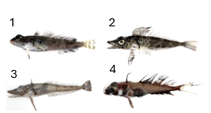

```{r}
#| include: false
knitr::opts_chunk$set(echo = TRUE)
```

# Introduction to Population Growth

Let's use descriptive statistics and data visualization to better understand population dynamics.

### Exponential Growth

A population that shows [exponential growth]{.underline} has a growth rate that depends on the average number of births (`b`) and deaths (`d`) per individual.

We call rates that are averages per individual in a population (rather than a total) *per capita* growth rates; *per capita* translates from Latin to "by head," meaning for individuals.

Combined, birth and death rates can be described as the [intrinsic rate of increase]{.underline} (`r`). We calculate `r` by subtracting the number of individuals that are removed from the population (deaths) from the number of individuals that are joining the population (births): $r = b - d$.

We can calculate by how many individuals the population will change in a given time period (`N`) by multiplying the starting population size (`Ni`) by the intrinsic rate of increase (`r`) using this equation:

{width="90" fig-align="center"}

### Logistic Growth

Populations that show logistic growth start out in the same way as populations with exponential growth–driven by *per capita* birth and death rates.

After a while, though, limited resources also start to come into play. When calculating the change in the size of the population (`N`), we also need to take into account the maximum number of individuals the population can sustainably support, called the [carrying capacity]{.underline}, `K`.

We use the following equation to calculate the population size:

{width="188" fig-align="center"}

### Visualizing Growth Models

As a reminder, this is what each type of population growth model looks like:

{width="75%" fig-align="center"}

# What Population Factors Matter?

We still need to figure out what fish population we will target for Antarctica.

Briefly, let's consider what we think might be important for sustainability.

1.  Large population
2.  Stable population (i.e., not declining)

## Fish Data

Let's look at fish data from around our station in Antarctica over the past 20 years to get a better feel for how different population factors impact fish populations. These fish moved into the bay by our station when we established it, so we know the populations started at around the same time and had the same starting populations.

These aren't necessarily our targets for fishing, particularly since it would be difficult and potentially disruptive to fish in the bay. Right now our goal is just to learn so we know what to look for when we are making our decision to conduct sustainable fishing.

{fig-align="center"}

As always, first we load the `tidyverse` and read in the data.

```{r}
library(tidyverse)
fish_pops <- read_csv("data/fish_pops.csv")
```

### Largest Population

Which population grows the biggest? Let's start by calculating some summary statistics of the data.

```{r}
max_pop <- fish_pops %>%
  group_by(population)%>%
  summarise(max_N = max(N))
max_pop
```

It looks like Population B grows the largest by far. Let's learn more about Population B and filter out the data so we can look at it separately.

```{r}
popB <- fish_pops %>%
  filter(population == "B")
popB
```

**What type of growth is the population exhibiting?**\
*Answer: Exponential.*

**Why is there no carrying capacity in this population data set? What does this mean about the resources Population B needs?**\
*Answer: Exponential models assume unlimited resources, so no carrying capacity (K) is included.*

### Exponential Growth Populations

It looks like populations exhibiting exponential growth might be good targets for our fishing operations because they can become very large. Let's look at the data we have on exponential growth populations a little closer.

Let's filter out the exponential growth models to examine them.

```{r}
exp_pops <-fish_pops %>%
  filter(growth_type == "exponential")
exp_pops
```

It's hard to see what's happening with only the data frame. Let's look at the exponential growth populations on the same plot:

```{r}
ggplot(exp_pops, aes(x = year, y = N, color = population)) +
  geom_point() +
  geom_line()+
  labs(x = "Time", y = "Abundance", color = "Population") +
  theme_light()
```

It looks like Population B is very large, but Population A stays small. It's hard to see what is happening on this plot because the scales are so different, so let's look at what is happening with Population A by filtering out the data just for that population.

```{r}
popA <-fish_pops %>%
  filter(population == "A")
popA
```

**What do you notice about Population A that is different than Population B?**\
*Answer: The intrinsic growth rate (r) for Population A is negative.*

The intrinsic rate of increase (r) for Population A is negative. Let's see what that means for Population A and plot it by itself:

```{r}
ggplot(popA, aes(x = year, y = N)) +
  geom_point() +
  geom_line()+
  labs(x = "Time", y = "Abundance") +
  theme_light()
```

**What has happened to this population?**\
*Answer: Population A crashes and reaches zero.*

Even with "exponential growth", the population has crashed (gone to 0), because *r* is negative. It took approximately 7 years for this to happen.

**Between Population A and Population B, which is a better target population for fishing? Why?**\
*Answer: Population B, because r \> 0 and it grows quickly.*

**Logistic growth populations**

Ok, so we can't rely only on the type of growth as a way to make our fishing decisions. But, we're still curious about our populations that are limited by resources (i.e., exhibiting logistic growth).

```{r}
log_pops <- fish_pops %>%
  filter(growth_type == "logistic")
log_pops
```

Notice in this case we have carrying capacity data. Let's use some data visualizations to help us understand what that means.

Let's look at the two logistic growth populations on the same plot:

```{r}
ggplot(log_pops, aes(x = year, y = N, color = population))+
  geom_point() +
  geom_line()+
  labs(x = "Time", y = "Abundance", color = "Population")+
  theme_light()
```

**Which population gets the largest?**\
*Answer: Population D*

### Finding the Carrying Capacity

When we have a logistic growth model, we often will want to find the carrying capacity of the population.

**What values does each population level off at?**

-   Population C: *20*

-   Population D: *100*

These are the carrying capacities. If you look back at the data, you will see Population C has a carrying capacity of 20 individuals, whereas Population D has a carrying capacity of 100 individuals. **Which population do you think might be the best candidate to fish between these two?** *Answer: Population D is more abundant and has a higher carrying capacity.*

**A review of what we have learned**

The following factors are important to know about a population before fishing:

1.  Exponential growth can result in bigger populations than logistic growth

2.  Intrinsic rate of increase (`r`) should not be negative

3.  A higher carrying capacity means the population can take advantage of more resources to grow larger, which may indicate that the population is a better candidate for fishing

## References

Golding, J.; Andersen, D.; Bledsoe, E. (2024). [Data-Driven Decision-Making: Antarctic Fisheries](http://dx.doi.org/10.25334/YECE-7M02). [Teaching Ecology for All Undergraduate Audiences](https://qubeshub.org/groups/teespring2024), QUBES Educational Resources. [doi:10.25334/YECE-7M02](http://dx.doi.org/10.25334/YECE-7M02)

Zhang, M., Liu, S., Bo, J., Zheng, R., Hong, F., Gao, F., Miao, X., Li, H., & Fang, C. (2022). First evidence of microplastic contamination in Antarctic fish (Actinopterygii, Perciformes), *Water*, *14*(19).